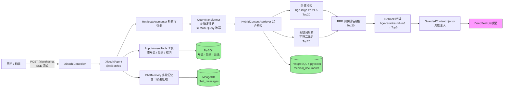

# 🏥 硅谷小智 · 医疗问诊 RAG + Agent

> 基于 **Java + LangChain4j** 实现的「北京协和医院」智能问诊助手。
> 支持流式回答、多轮记忆、检索增强生成（RAG）与真实预约挂号工具调用，打通「问诊咨询 → 智能分导诊 → 在线挂号」完整链路。

[](https://www.java.com/)
[](https://spring.io/projects/spring-boot)
[](https://docs.langchain4j.dev/)
[](src/test/java/com/hxm/java/ai/langchain4j/RagEvaluationTest.java)
[](src/test/java/com/hxm/java/ai/langchain4j/RagAnswerQualityTest.java)
[](src/test/java/com/hxm/java/ai/langchain4j/RagAnswerQualityTest.java)

---

## 目录

- [核心亮点](#核心亮点)
- [系统架构](#系统架构)
- [核心实现](#核心实现)
- [离线评估](#离线评估)
- [快速开始](#快速开始)
- [API 接口](#api-接口)
- [项目结构](#项目结构)
- [已知限制](#已知限制)

---

## 核心亮点

1. **真正的 Agent，不止 RAG**：基于 LangChain4j `@AiService` 声明式装配 —— 流式输出（SSE）+ 多轮记忆 + 工具调用 + RAG 检索增强四合一。
2. **两阶段混合检索**：粗召回（向量语义 + 自研中文关键词，RRF 融合 Top20）→ 精排（交叉编码器 bge-reranker ReRank Top5），兼顾「语义理解」与「精确数字/专有名词」。
3. **自研 ReRank 打分模型**：LangChain4j 无硅基流动现成实现，基于 JDK HttpClient 手写 `ScoringModel` 接入检索管线。
4. **防幻觉设计**：检索为空 → 明确说「不知道」；挂号工具强制「可预约医生仅以工具返回为准」，杜绝模型用知识库里的医生姓名编造号源。
5. **量化评估**：检索层（Recall / MRR）+ 生成层（LLM-as-Judge 正确率 / 忠实度）双评估体系，用数字驱动每一轮优化。

---

## 系统架构



## 技术栈

| 分类 | 技术 |
|---|---|
| 语言 / 框架 | Java 17 · Spring Boot 3.2.6 · LangChain4j 1.0.0 |
| LLM | DeepSeek（`deepseek-chat`，OpenAI 兼容接口，流式 / 非流式） |
| Embedding | 硅基流动 `BAAI/bge-large-zh-v1.5`（1024 维） |
| ReRank | 硅基流动 `BAAI/bge-reranker-v2-m3`（交叉编码器） |
| 业务库 | MySQL · MyBatis-Plus 3.5.11（号源 / 预约 / 会话） |
| 向量库 | PostgreSQL + pgvector（`medical_documents` 表） |
| 记忆存储 | MongoDB（消息序列化持久化） |
| 接口文档 | Knife4j（OpenAPI 3） |
| 测试 | JUnit 5 · Spring Boot Test |

---

## 核心实现

### 1. RAG 检索流程（两阶段：粗召回 → 精排）

**痛点**：向量检索懂语义，但会漏精确数字与专有名词（如「16万人次」「010-69151188」）；关键词检索懂字面，但不懂同义改写。单一通道召回率低。

**方案**（[HybridContentRetriever.java](src/main/java/com/hxm/java/ai/langchain4j/rag/HybridContentRetriever.java)）：

1. **粗召回**：向量语义检索 + 自研中文关键词检索各取 Top20，用 **RRF（倒数排名融合）** 合并取 Top20 —— RRF 只看相对名次不看分数量纲，天然融合异构召回源，无需调权重。
2. **精排**：调用交叉编码器 `bge-reranker-v2-m3` 对候选逐条打分，重排取 Top5。

**自研关键词检索**：用「字符二元组」匹配。为什么不用 PostgreSQL 的 `similarity()`？它按空格分词、面向英文，中文短 query 对长文档相似度恒为 0，等于噪声。

**自研 ReRank 实现**（[SiliconFlowScoringModel.java](src/main/java/com/hxm/java/ai/langchain4j/config/SiliconFlowScoringModel.java)）：实现 LangChain4j `ScoringModel` 接口，用 JDK HttpClient 调硅基流动 `/v1/rerank`，精排异常时自动降级为粗召回顺序，不阻塞主流程。

### 2. 防幻觉设计（三层）

医疗场景下幻觉是红线 —— 之前真出现过「没检索到却编错服务热线」的事故。三层防御：

| 层级 | 措施 |
|---|---|
| **检索为空 → 说不知道** | [GuardedContentInjector.java](src/main/java/com/hxm/java/ai/langchain4j/rag/GuardedContentInjector.java)：检索为空时注入「知识库无相关信息，必须明确说不知道，禁止编造」指令，阻止模型裸答 |
| **工具描述约束** | 挂号工具的 `@Tool` 描述写死「可预约医生仅以本工具返回为准，严禁使用知识库中的医生姓名推荐或预约」 |
| **工具代码真实校验** | [AppointmentTools.java](src/main/java/com/hxm/java/ai/langchain4j/tools/AppointmentTools.java)：防重复预约（数据库查重）→ 真实号源校验（`booked_slots < total_slots`）→ 保存后号源 -1 / 取消时 +1 一致性；`setId(null)` 防模型幻觉填主键 |

**查询路由**：「是否检索」用**确定性关键词判断**（寒暄 / 闲聊才跳过检索），LLM 只负责改写 —— 避免 LLM 分类抖动导致「该检索的不检索」。

### 3. 多轮记忆（窗口摘要压缩）

基于 `MongoChatMemoryStore` + 自研 `SummaryChatMemory`：消息数超过阈值（20 条）时自动调用 LLM **压缩历史为摘要**，保留最近 10 条完整消息 —— 既控制 token 成本，又不丢关键上下文。

---

## 离线评估

> 口径：14 条自建问答评估集（覆盖地址 / 电话 / 时间 / 交通 / 科室列表 / 医生擅长 / 医院级别等）。

### 检索层（[RagEvaluationTest](src/test/java/com/hxm/java/ai/langchain4j/RagEvaluationTest.java)）

| 配置 | Recall@1 | Recall@3 | Recall@5 | Hit@5 | MRR |
|---|---|---|---|---|---|
| 纯向量 | 0.714 | 0.929 | 1.000 | 1.000 | 0.815 |
| **混合（向量 + 关键词 RRF → ReRank）** | **1.000** | **1.000** | **1.000** | **1.000** | **1.000** |

### 答案质量（[RagAnswerQualityTest](src/test/java/com/hxm/java/ai/langchain4j/RagAnswerQualityTest.java)，LLM-as-Judge）

| 指标 | 得分 |
|---|---|
| 加权正确率 | **0.964**（13 条完全正确 + 1 条部分正确） |
| 加权忠实度 | **1.000**（14/14 完全忠实，无编造） |

### 调优过程（为什么能到满分）

| 阶段 | Recall@1 | 正确率 | 忠实度 | 做了什么 |
|---|---|---|---|---|
| 初始（仅向量） | 0.214 | 0.607 | 0.286 | 基线 |
| + 混合检索 / ReRank | 0.464 | 0.714 | 0.357 | 加关键词通道 + RRF + 交叉编码器精排 |
| 清库重灌 | **1.000** | 0.714 | 0.429 | 修复重复灌库（chunk 双份挤占 Top-K）+ 500/50 分块（消除孤儿碎片） |
| 改写器修复 | 1.000 | 0.857 | 0.786 | 扩大检索路由范围（医院电话 / 地址也算知识）+ 保留原问题 |
| 确定性路由 | 1.000 | **0.964** | **1.000** | 「是否检索」改代码判断，消除 LLM 分类抖动 |

---

## 快速开始

### 环境要求

| 依赖 | 说明 |
|---|---|
| JDK 17+ | 已在 21 上测试 |
| Maven 3.6+ | |
| MySQL | 业务库 `guiguxiaozhi` |
| PostgreSQL 16 + `pgvector` 扩展 | 向量库 `rag_db` |
| MongoDB | 本地 `localhost:27017` |
| DeepSeek API Key | `DEEPSEEK_API_KEY` |
| 硅基流动 API Key | `EMBEDDING_API_KEY`（embedding + rerank 共用） |

### 1. 配置环境变量

```bash
export DEEPSEEK_API_KEY=sk-xxx
export EMBEDDING_API_KEY=sk-xxx
```

### 2. 准备数据库

**MySQL**（执行 `src/main/resources/sql/` 下的脚本）：

```sql
-- conversation.sql 与 doctor_schedule.sql 已含建表 + 测试排班数据
-- appointment 预约记录表：
CREATE TABLE IF NOT EXISTS appointment (
    id          BIGINT AUTO_INCREMENT PRIMARY KEY COMMENT '主键',
    username    VARCHAR(50)  NOT NULL COMMENT '姓名',
    id_card     VARCHAR(30)  NOT NULL COMMENT '身份证号',
    department  VARCHAR(50)  NOT NULL COMMENT '科室',
    date        VARCHAR(20)  NOT NULL COMMENT '日期',
    time        VARCHAR(10)  NOT NULL COMMENT '时段：上午/下午',
    doctor_name VARCHAR(50)  NOT NULL COMMENT '医生'
) COMMENT '预约记录表';
```

**PostgreSQL**：

```sql
CREATE DATABASE rag_db;
-- 连接 rag_db 后执行：CREATE EXTENSION IF NOT EXISTS vector;
```

> 向量表 `medical_documents` 由 PgVectorEmbeddingStore 首次灌库时自动创建（dimension=1024）。

### 3. 灌入知识库

知识文档位于 `src/test/java/.../LLMTest#testUploadKnowledgeLibrary` 中引用的目录（默认 `C:/Users/gxds2/Desktop/agent/knowledge/*.md`，可按需修改路径）。执行该测试即可完成「清空旧数据 → 分块（500 字符 / 50 重叠）→ 向量化入库」。

### 4. 运行离线评估

```bash
# 检索层评估（需先灌库）
mvn test -Dtest=RagEvaluationTest

# 答案质量评估（需 API Key 可用）
mvn test -Dtest=RagAnswerQualityTest

# 语料对齐核对工具
mvn test -Dtest=CorpusAlignmentTest
```

### 5. 启动服务

```bash
mvn spring-boot:run
```

访问接口文档：`http://localhost:8080/doc.html`

---

## API 接口

| 方法 | 路径 | 说明 |
|---|---|---|
| POST | `/xiaozhi/chat` | 流式对话（SSE），响应头 `X-Conversation-Id` 返回会话 id |
| GET | `/xiaozhi/conversations` | 对话列表 |
| POST | `/xiaozhi/conversations` | 新建对话 |
| PUT | `/xiaozhi/conversations/{id}` | 重命名对话 |
| DELETE | `/xiaozhi/conversations/{id}` | 删除对话 |
| GET | `/xiaozhi/conversations/{id}/messages` | 对话消息历史（自动剔除检索注入内容） |

---

## 项目结构

```
src/main/java/com/hxm/java/ai/langchain4j/
├── XiaozhiApp.java                 # 启动类
├── assistant/
│   └── XiaozhiAgent.java           # @AiService：流式 + 记忆 + 工具 + RAG
├── controller/
│   └── XiaozhiController.java      # SSE 流式接口 + 会话管理
├── config/
│   ├── DataSourceConfig.java       # MySQL 主数据源（@Primary）
│   ├── EmbeddingStoreConfig.java   # PostgreSQL + pgvector 数据源 / 向量库
│   ├── SiliconFlowConfig.java      # embedding + rerank bean
│   ├── SiliconFlowScoringModel.java# 自研 ReRank 打分模型实现
│   └── XiaozhiAgentConfig.java     # 查询改写 / 混合检索 / 检索增强器
├── rag/
│   ├── HybridContentRetriever.java # 粗召回(RRF) + 精排(ReRank)
│   └── GuardedContentInjector.java # 检索为空 → 说不知道
├── tools/
│   ├── AppointmentTools.java       # 查号源 / 预约 / 取消（防幻觉）
│   └── CalculatorTools.java        # 计算工具（能力演示）
├── store/
│   └── MongoChatMemoryStore.java   # 记忆持久化
├── entity/  service/  mapper/      # 预约、号源、会话业务层
└── resources/
    ├── application.properties
    ├── zhaozhi-prompt-template.txt # 系统提示词
    └── sql/                        # 建表脚本
```

---

## 已知限制

- **语料规模小**：仅 3 篇知识文档、评估集 14 条，Recall=1.000 部分受益于语料小。扩展更多科室文档后指标会更可信。
- **号源扣减无并发保护**：当前为「先查后改」，未加乐观锁 / 原子 SQL，生产环境需升级为 `UPDATE ... WHERE booked_slots < total_slots` 原子扣减。
- **LLM-as-Judge 有噪声**：结论基于 DeepSeek 判定，适合做 A/B 对比而非绝对真理，建议关键结论人工抽检。
- **知识文档路径硬编码**：灌库测试指向本地绝对路径，仓库外部署需调整。
