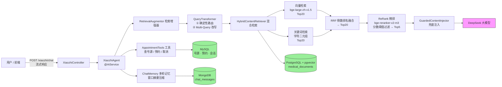

# 🏥 硅谷小智 · 医疗问诊 RAG + Agent

> 基于 **Java + LangChain4j** 实现的「北京协和医院」智能问诊助手。
> 支持流式回答、多轮记忆、检索增强生成（RAG）与真实预约挂号工具调用，打通「问诊咨询 → 智能分导诊 → 在线挂号」完整链路。

[](https://www.java.com/)
[](https://spring.io/projects/spring-boot)
[](https://docs.langchain4j.dev/)
[](src/test/java/com/hxm/java/ai/langchain4j/RagEvaluationTest.java)
[](src/test/java/com/hxm/java/ai/langchain4j/RagAnswerQualityTest.java)
[](src/test/java/com/hxm/java/ai/langchain4j/RagAnswerQualityTest.java)

---

## 目录

- [核心亮点](#核心亮点)
- [系统架构](#系统架构)
- [核心实现](#核心实现)
- [离线评估](#离线评估)
- [快速开始](#快速开始)
- [API 接口](#api-接口)
- [关键配置项](#关键配置项)
- [项目结构](#项目结构)
- [已知限制](#已知限制)

---

## 核心亮点

1. **真正的 Agent，不止 RAG**：基于 LangChain4j `@AiService` 声明式装配 —— 流式输出 + 多轮记忆 + 工具调用 + RAG 检索增强四合一。
2. **两阶段混合检索 + 阈值拒答**：粗召回（向量语义 + 自研中文关键词，RRF 融合 Top20）→ 精排（交叉编码器 bge-reranker ReRank，**分数阈值过滤**后取 Top5），兼顾「语义理解」与「精确数字/专有名词」，并能识别「知识库压根没覆盖」的问题。
3. **自研 ReRank 打分模型**：LangChain4j 无硅基流动现成实现，基于 JDK HttpClient 手写 `ScoringModel` 接入检索管线。
4. **防幻觉设计**：ReRank 分数低于阈值一律丢弃 → 全部不达标时明确说「不知道」；挂号工具强制「可预约医生仅以工具返回为准」，杜绝模型用知识库里的医生姓名编造号源。
5. **量化评估**：检索层（Recall / MRR）+ 生成层（LLM-as-Judge 正确率 / 忠实度）双评估体系，用数字驱动每一轮优化。

---

## 系统架构



## 技术栈

| 分类 | 技术 |
|---|---|
| 语言 / 框架 | Java 17 · Spring Boot 3.2.6 · LangChain4j 1.0.0-beta4 |
| LLM | DeepSeek（`deepseek-chat`，OpenAI 兼容接口，流式 / 非流式） |
| Embedding | 硅基流动 `BAAI/bge-large-zh-v1.5`（1024 维） |
| ReRank | 硅基流动 `BAAI/bge-reranker-v2-m3`（交叉编码器） |
| 业务库 | MySQL · MyBatis-Plus 3.5.11（号源 / 预约 / 会话） |
| 向量库 | PostgreSQL + pgvector（`medical_documents` 表） |
| 记忆存储 | MongoDB（消息序列化持久化） |
| 接口文档 | Knife4j（OpenAPI 3） |
| 前端 | Vue 3 · Vite 5 · Element Plus（`frontend/` 目录） |
| 测试 | JUnit 5 · Spring Boot Test |

---

## 核心实现

### 1. RAG 检索流程（粗召回 → 精排 → 阈值拒答）

**痛点**：向量检索懂语义，但会漏精确数字与专有名词（如「16万人次」「010-69151188」）；关键词检索懂字面，但不懂同义改写。单一通道召回率低。

**方案**（[HybridContentRetriever.java](src/main/java/com/hxm/java/ai/langchain4j/rag/HybridContentRetriever.java)）：

1. **粗召回**：向量语义检索 + 自研中文关键词检索各取 Top20，用 **RRF（倒数排名融合）** 合并取 Top20 —— RRF 只看相对名次不看分数量纲，天然融合异构召回源，无需调权重。
2. **精排**：调用交叉编码器 `bge-reranker-v2-m3` 对候选逐条打分。
3. **阈值拒答**：分数低于 `xiaozhi.rag.rerank-threshold`（默认 `0.1`）的候选一律丢弃，剩余按分数降序取 Top5；若全部不达标则返回空列表，交给 `GuardedContentInjector` 走「说不知道」。**注意这里不能因为「候选数已 ≤ 5 就跳过打分」而短路** —— 一旦跳过就没有分数，阈值便无从施加，候选少恰恰更需要判相关性。

**自研关键词检索**：用「字符二元组」匹配。为什么不用 PostgreSQL 的 `similarity()`？它按空格分词、面向英文，中文短 query 对长文档相似度恒为 0，等于噪声。

**自研 ReRank 实现**（[SiliconFlowScoringModel.java](src/main/java/com/hxm/java/ai/langchain4j/config/SiliconFlowScoringModel.java)）：实现 LangChain4j `ScoringModel` 接口，用 JDK HttpClient 调硅基流动 `/v1/rerank`，精排异常时自动降级为粗召回顺序，不阻塞主流程。

### 2. 防幻觉设计（四层）

医疗场景下幻觉是红线 —— 之前真出现过「没检索到却编错服务热线」的事故。四层防御：

| 层级 | 措施 |
|---|---|
| **ReRank 分数阈值拒答** | [HybridContentRetriever.java](src/main/java/com/hxm/java/ai/langchain4j/rag/HybridContentRetriever.java)：精排分数低于 `xiaozhi.rag.rerank-threshold` 的结果全部丢弃，避免「勉强凑一个最像的」塞进上下文（详见下方[阈值取值依据](#阈值取值依据)） |
| **检索为空 → 说不知道** | [GuardedContentInjector.java](src/main/java/com/hxm/java/ai/langchain4j/rag/GuardedContentInjector.java)：检索为空时注入「知识库无相关信息，必须明确说不知道，禁止编造」指令，阻止模型裸答 |
| **工具描述约束** | 挂号工具的 `@Tool` 描述写死「可预约医生仅以本工具返回为准，严禁使用知识库中的医生姓名推荐或预约」 |
| **工具代码真实校验** | [AppointmentTools.java](src/main/java/com/hxm/java/ai/langchain4j/tools/AppointmentTools.java)：防重复预约（数据库查重）→ 真实号源校验（`booked_slots < total_slots`）→ 保存后号源 -1 / 取消时 +1 一致性；`setId(null)` 防模型幻觉填主键 |

**查询路由**：「是否检索」用**确定性关键词判断**（寒暄 / 闲聊才跳过检索），LLM 只负责改写 —— 避免 LLM 分类抖动导致「该检索的不检索」。

**为什么阈值是必需的**：`vectorRetriever` 的 `minScore` 设为 `0.0`，即「无论如何都返回 Top-K 个最像的」。对知识库完全不覆盖的问题（如「帮我写个快排」），它依然会返回 20 个无关片段，模型拿到这些上下文就容易硬凑答案。阈值把「最像」和「相关」区分开。

#### 阈值取值依据

实测（[RerankThresholdTest](src/test/java/com/hxm/java/ai/langchain4j/RerankThresholdTest.java)）：

| 问题类型 | top1 ReRank 分数 |
|---|---|
| 域内（知识库覆盖，14 条评估集） | 下界 **0.85** |
| 域外（知识库完全不覆盖，8 条负样本） | 上界 **0.014** |

两者之间有两个数量级的空白，阈值 `0.1` 位于该间隙的对数中点 —— 距噪声上界约 7 倍、距信号下界约 8.5 倍，两侧余量对称。该测试已固化为回归用例，域内问题不被误拒、域外问题全部拒绝、拒答时返回空列表而非 `【无需检索】` 哨兵值。

### 3. 多轮记忆（窗口摘要压缩）

基于 `MongoChatMemoryStore` + 自研 `SummaryChatMemory`：消息数超过阈值（20 条）时自动调用 LLM **压缩历史为摘要**，保留最近 10 条完整消息 —— 既控制 token 成本，又不丢关键上下文。

---

## 离线评估

> 口径：14 条自建问答评估集（覆盖地址 / 电话 / 时间 / 交通 / 科室列表 / 医生擅长 / 医院级别等）。

### 检索层（[RagEvaluationTest](src/test/java/com/hxm/java/ai/langchain4j/RagEvaluationTest.java)）

| 配置 | Recall@1 | Recall@3 | Recall@5 | Hit@5 | MRR |
|---|---|---|---|---|---|
| 纯向量 | 0.714 | 0.929 | 1.000 | 1.000 | 0.815 |
| **混合（向量 + 关键词 RRF → ReRank）** | **1.000** | **1.000** | **1.000** | **1.000** | **1.000** |

### 答案质量（[RagAnswerQualityTest](src/test/java/com/hxm/java/ai/langchain4j/RagAnswerQualityTest.java)，LLM-as-Judge）

| 指标 | 得分 |
|---|---|
| 加权正确率 | **0.964**（13 条完全正确 + 1 条部分正确） |
| 加权忠实度 | **1.000**（14/14 完全忠实，无编造） |

### 调优过程（为什么能到满分）

| 阶段 | Recall@1 | 正确率 | 忠实度 | 做了什么 |
|---|---|---|---|---|
| 初始（仅向量） | 0.214 | 0.607 | 0.286 | 基线 |
| + 混合检索 / ReRank | 0.464 | 0.714 | 0.357 | 加关键词通道 + RRF + 交叉编码器精排 |
| 清库重灌 | **1.000** | 0.714 | 0.429 | 修复重复灌库（chunk 双份挤占 Top-K）+ 500/50 分块（消除孤儿碎片） |
| 改写器修复 | 1.000 | 0.857 | 0.786 | 扩大检索路由范围（医院电话 / 地址也算知识）+ 保留原问题 |
| 确定性路由 | 1.000 | **0.964** | **1.000** | 「是否检索」改代码判断，消除 LLM 分类抖动 |
| ReRank 阈值拒答 | 1.000 | 0.964 | 1.000 | 加分数阈值 0.1 + 新增域外拒答回归测试（`RerankThresholdTest` 3 例），检索指标零回退 |

> 阈值改造后已复测：混合检索 Recall@1/3/5、Hit@5、MRR 全部维持 1.000，无回归。

---

## 快速开始

### 环境要求

| 依赖 | 说明 |
|---|---|
| JDK 17+ | 已在 21 上测试；需确保 `JAVA_HOME` 指向 JDK 17+，`mvn` 走的是同一个 JDK |
| Maven 3.6+ | |
| MySQL 8 | 业务库 `guiguxiaozhi`，连接串见 `application.properties` |
| PostgreSQL 16 + `pgvector` 扩展 | 向量库 `rag_db`，**连接信息硬编码在 `EmbeddingStoreConfig.java`，与下方示例不一致时必须先改配置** |
| MongoDB | 本地 `localhost:27017`，库 `chat_memory_db` |
| DeepSeek API Key | `DEEPSEEK_API_KEY` |
| 硅基流动 API Key | `EMBEDDING_API_KEY`（embedding + rerank 共用） |

### 1. 配置环境变量

```bash
export DEEPSEEK_API_KEY=sk-xxx
export EMBEDDING_API_KEY=sk-xxx
```

### 2. 准备数据库

**MySQL**（库名 `guiguxiaozhi`）：

`src/main/resources/sql/` 下现有 `conversation.sql`（会话元数据表）与 `doctor_schedule.sql`（号源表 + 测试排班数据），按顺序执行即可。

**预约记录表 `appointment` 目前没有独立脚本**，需手动执行下列 DDL（[Appointment.java](src/main/java/com/hxm/java/ai/langchain4j/entity/Appointment.java) 未标 `@TableName`，靠 MyBatis-Plus 类名约定映射到 `appointment`；脚本缺失是待补项）：

```sql
CREATE TABLE IF NOT EXISTS appointment (
    id          BIGINT AUTO_INCREMENT PRIMARY KEY COMMENT '主键',
    username    VARCHAR(50)  NOT NULL COMMENT '姓名',
    id_card     VARCHAR(30)  NOT NULL COMMENT '身份证号',
    department  VARCHAR(50)  NOT NULL COMMENT '科室',
    date        VARCHAR(20)  NOT NULL COMMENT '日期',
    time        VARCHAR(10)  NOT NULL COMMENT '时段：上午/下午',
    doctor_name VARCHAR(50)  NOT NULL COMMENT '医生'
) COMMENT '预约记录表';
```

> MySQL 8 的 root 默认用 `caching_sha2_password`，首次认证要么走 TLS、要么用服务端 RSA 公钥加密密码。
> 本项目 `spring.datasource.url` 里 `useSSL=false` 关掉了 TLS，因此必须显式带 `allowPublicKeyRetrieval=true`，
> 否则驱动会抛 `Public Key Retrieval is not allowed`（且服务端认证缓存过期后会复现，不是一次性问题）。
> ⚠️ 该参数在非受信网络上存在中间人替换公钥的风险，生产环境应改用 `sslMode=REQUIRED`。

**PostgreSQL**：

```sql
CREATE DATABASE rag_db;
-- 连接 rag_db 后执行：CREATE EXTENSION IF NOT EXISTS vector;
```

> ⚠️ 代码里 [EmbeddingStoreConfig.java](src/main/java/com/hxm/java/ai/langchain4j/config/EmbeddingStoreConfig.java) 的 PG 连接信息是**硬编码**的，
> 默认指向内网地址 `192.168.116.130:5432`（用户 `postgres`）。本地装 PG 的话必须先改这个类，光按上面建库是连不上的。
> 待办：抽到 `application.properties` 配置项。

> 向量表 `medical_documents` 由 PgVectorEmbeddingStore 首次灌库时自动创建（dimension=1024）。
> 灌库完成后执行 `src/main/resources/sql/medical_documents_hnsw.sql` 建 HNSW 索引
> （langchain4j 1.0.0-beta4 自动建的是 IVFFlat，开发环境改用 HNSW，此处固化保持一致）。

### 3. 灌入知识库

入口在 [LLMTest.java](src/test/java/com/atguigu/java/ai/langchain4j/LLMTest.java) 的 `testUploadKnowledgeLibrary`，文档目录**硬编码**在方法内（默认 `C:/Users/gxds2/Desktop/agent/knowledge/`，示例为 3 篇 `.md`），执行前需改成自己的路径。

执行该测试即可完成「清空旧数据 → 分块（500 字符 / 50 重叠）→ 向量化入库」。

**支持多格式**：`parserFor(Path)` 按扩展名分派解析器 ——

| 扩展名 | 解析器 |
|---|---|
| `.md` / `.txt` | `TextDocumentParser` |
| `.pdf` | `ApachePdfBoxDocumentParser` |
| `.doc` / `.docx` / `.xls` / `.xlsx` | `ApacheTikaDocumentParser` |

其他扩展名直接抛 `IllegalArgumentException`。注意：不同格式解析出的文本结构差异很大，会直接影响分块质量（见[已知限制](#已知限制)中 PDF 相关条目）。

### 4. 运行离线评估

```bash
# 检索层评估（需先灌库）
mvn test -Dtest=RagEvaluationTest

# 答案质量评估（需 API Key 可用）
mvn test -Dtest=RagAnswerQualityTest

# 阈值回归测试（域内不误拒 + 域外全拒绝）
mvn test -Dtest=RerankThresholdTest

# 语料对齐核对工具
mvn test -Dtest=CorpusAlignmentTest
```

### 5. 启动服务

```bash
mvn spring-boot:run
```

访问接口文档：`http://localhost:8080/doc.html`

---

## API 接口

| 方法 | 路径 | 说明 |
|---|---|---|
| POST | `/xiaozhi/chat` | 流式对话（`Flux<String>` 分块下发），响应头 `X-Conversation-Id` 返回会话 id |
| GET | `/xiaozhi/conversations` | 对话列表 |
| POST | `/xiaozhi/conversations` | 新建对话 |
| PUT | `/xiaozhi/conversations/{id}` | 重命名对话 |
| DELETE | `/xiaozhi/conversations/{id}` | 删除对话 |
| GET | `/xiaozhi/conversations/{id}/messages` | 对话消息历史（自动剔除检索注入内容） |

> ⚠️ 流式接口的 `Content-Type` 是 `text/stream;charset=utf-8`，**不是标准的 `text/event-stream`**。
> 前端用 `EventSource` 会连不上，需按普通 chunked 文本流用 `fetch` + `ReadableStream` 处理。
> 另外该接口目前**没有鉴权**，`{id}` 也未做归属校验（越权可读他人会话），详见[已知限制](#已知限制)。

### 关键配置项

[application.properties](src/main/resources/application.properties)：

| 配置项 | 默认值 | 说明 |
|---|---|---|
| `server.port` | `8080` | |
| `xiaozhi.rag.rerank-threshold` | `0.1` | ReRank 分数阈值，低于此分的检索结果一律丢弃；全部不达标则走「说不知道」。取值依据见上文 |
| `spring.datasource.url` | `jdbc:mysql://localhost:3306/guiguxiaozhi?...` | 需带 `allowPublicKeyRetrieval=true`（MySQL 8 认证要求） |
| `spring.data.mongodb.uri` | `mongodb://localhost:27017/chat_memory_db` | |
| `langchain4j.open-ai.chat-model.log-requests` / `log-responses` | `true` | 会把完整 prompt 与回答打进日志，**含患者问诊内容，生产环境必须关掉** |

环境变量（**仅从环境变量读取，不落盘**）：

| 变量 | 用途 |
|---|---|
| `DEEPSEEK_API_KEY` | DeepSeek 对话模型 |
| `EMBEDDING_API_KEY` | 硅基流动 embedding（bge-large-zh-v1.5）+ rerank，**两个能力共用一个 Key**；该变量无默认值，未设置会直接启动失败 |

---

## 项目结构

```
src/main/java/com/hxm/java/ai/langchain4j/
├── XiaozhiApp.java                 # 启动类
├── assistant/
│   └── XiaozhiAgent.java           # @AiService：流式 + 记忆 + 工具 + RAG
├── controller/
│   └── XiaozhiController.java      # 流式对话接口 + 会话管理
├── config/
│   ├── DataSourceConfig.java       # MySQL 主数据源（@Primary）
│   ├── EmbeddingStoreConfig.java   # PostgreSQL + pgvector 数据源 / 向量库
│   ├── SiliconFlowConfig.java      # embedding + rerank bean
│   ├── SiliconFlowScoringModel.java# 自研 ReRank 打分模型实现
│   ├── XiaozhiAgentConfig.java     # 查询改写 / 混合检索 / 检索增强器 / 记忆
│   └── SeparateChatAssistantConfig.java # 多会话隔离示例（教学用）
├── rag/
│   ├── HybridContentRetriever.java # 粗召回(RRF) + 精排(ReRank) + 阈值过滤
│   └── GuardedContentInjector.java # 检索为空 → 说不知道
├── memory/
│   └── SummaryChatMemory.java      # 超阈值压缩为摘要 + 保留最近消息
├── tools/
│   ├── AppointmentTools.java       # 查号源 / 预约 / 取消（防幻觉）
│   └── CalculatorTools.java        # 计算工具（能力演示）
├── store/
│   └── MongoChatMemoryStore.java   # 记忆持久化
├── entity/  service/  mapper/      # 预约、号源、会话业务层
└── resources/
    ├── application.properties
    ├── zhaozhi-prompt-template.txt # 系统提示词
    └── sql/
        ├── conversation.sql        # 会话元数据表
        ├── doctor_schedule.sql     # 号源表 + 测试排班数据
        └── medical_documents_hnsw.sql # 向量表 HNSW 索引（PG）

src/test/java/
├── com/hxm/java/ai/langchain4j/
│   ├── RerankThresholdTest.java        # 阈值回归：域内不误拒 / 域外全拒绝
│   ├── RagEvaluationTest.java          # 检索层指标（Recall / MRR）
│   ├── RagAnswerQualityTest.java       # 生成层指标（LLM-as-Judge 正确率 / 忠实度）
│   ├── GuardedContentInjectorTest.java # 兜底注入器单测（不依赖外部服务）
│   ├── CorpusAlignmentTest.java        # 语料对齐核对 + PG 索引检查
│   └── AugmentorDebugTest.java         # 检索管线调试（打印中间结果）
└── com/atguigu/java/ai/langchain4j/
    ├── LLMTest.java                    # 灌库入口（多格式解析）
    └── DocumentParserSupportTest.java  # 解析器分派单测
```

> 测试代码分布在 `com.hxm.*` 与 `com.atguigu.*` 两个包下（历史原因：灌库入口沿用教程包名），并非重复代码。

### 前端（`frontend/`）

Vue 3 + Vite + Element Plus 实现的问诊界面：会话列表（新建 / 重命名 / 删除）、消息气泡、流式增量渲染。

```
frontend/
├── index.html
├── vite.config.js              # /api 代理到 http://localhost:8080
└── src/
    ├── main.js
    ├── App.vue
    └── components/
        └── ChatWindow.vue      # 全部界面逻辑（侧边栏 + 消息列表 + 输入框）
```

启动：

```bash
cd frontend
npm install
npm run dev
```

> 需先启动后端（`mvn spring-boot:run`，默认 8080），前端所有请求走 `/api` 前缀，由 [vite.config.js](frontend/vite.config.js) 转发并去掉前缀。

**前后端的流式配合**：后端返回 `text/stream;charset=utf-8`（**不是标准 `text/event-stream`**），前端因此不能用 `EventSource`，而是用 `axios` 的 `responseType: 'stream'` + `onDownloadProgress` 累积读取 `responseText` 并做增量 diff 渲染。两端是配套的 —— 改后端 `Content-Type` 会直接打断前端。

---

## 已知限制

> 这里区分两类：**评估口径本身的局限**（指标可能虚高）与**工程实现缺口**（真上生产会出事）。

### 评估口径的局限

- **语料规模小**：仅 3 篇知识文档、评估集 14 条，Recall=1.000 部分受益于语料小。扩展更多科室文档后指标会更可信。
- **ReRank 阈值基于 22 条样本**：域内 14 条 + 域外 8 条，样本量偏小，「0.85 / 0.014」这对边界换一批问题可能会移动。阈值取的是对数中点，两侧留有 7~8 倍余量，但仍建议扩样本后复核。
- **评估逻辑存在循环论证倾向**：评估集 ground truth 用 `text.contains(expected)` 判定，而关键词通道的匹配逻辑同样是 `text.contains(gram)` —— 同一把尺子量两次，会系统性偏袒关键词通路。真正独立的验证应换人工标注或换个判定口径。
- **LLM-as-Judge 有噪声**：结论基于 DeepSeek 判定，适合做 A/B 对比而非绝对真理，建议关键结论人工抽检。
- **Judge 输出解析不够健壮**：`RagAnswerQualityTest` 按关键词匹配模型输出（且已处理「不忠实」包含「忠实」的顺序问题），但若模型改用「不正确」等同义表述，会被判为「正确」。建议改为强制结构化输出（如 `EnumOutputParser`）。

### 工程实现缺口（按严重度排序）

- **接口无鉴权**：`/xiaozhi/**` 全部裸奔，且 `/conversations/{id}/messages` 未校验会话归属，改个 id 就能读别人问诊记录（IDOR）。医疗数据属敏感个人信息，这是最该优先补的一项。
- **号源扣减无并发保护（超卖）**：[DoctorScheduleServiceImpl](src/main/java/com/hxm/java/ai/langchain4j/service/impl/DoctorScheduleServiceImpl.java) 的 `decrementSlot()` 是「先 SELECT 判断 `booked_slots < total_slots`，再 UPDATE 自增」两步。两个请求同时通过 SELECT 检查就会超卖。正确做法是把条件下推到单条原子 SQL：`UPDATE doctor_schedule SET booked_slots = booked_slots + 1 WHERE id = ? AND booked_slots < total_slots`，再按影响行数判断成败。
- **预约流程无事务**：`bookAppointment` 依次执行「查重 → 校验号源 → 保存预约 → 扣减号源」，四步不在同一事务里，中间失败会留下「有预约记录但号源没扣」的脏数据。
- **数据库口令明文入库**：[EmbeddingStoreConfig.java](src/main/java/com/hxm/java/ai/langchain4j/config/EmbeddingStoreConfig.java)（PG）与 `application.properties`（MySQL）均为明文口令，且 PG 地址是内网 IP。应改为环境变量注入，并轮换已泄露的口令。
- **同一 memoryId 并发写会丢消息**：`MongoChatMemoryStore.updateMessages` 是整篇文档覆盖（序列化全量消息后 `upsert`），同一会话并发两条请求时后写会覆盖先写。
- **流式接口无错误处理**：`Flux` 链路没有 `onErrorResume`，下游模型 / 检索异常会直接中断响应，客户端拿到半截内容且无提示。
- **输入无校验**：`ChatForm.message` 未做非空 / 长度限制，可被超长输入打爆上下文与 API 计费。
- **前端用 `v-html` 渲染模型输出**：[ChatWindow.vue](frontend/src/components/ChatWindow.vue) 里消息内容是 `v-html` 注入的。模型输出若包含 HTML 会被当标签渲染，配合「输入无校验 + 知识库文档可控」，存在 XSS 风险。应改为纯文本渲染，或接入 DOMPurify 之类做白名单过滤。
- **PG 配置硬编码**：连接信息写死在 Java 类里，换环境必须改代码。
- **知识文档路径硬编码**：灌库测试指向本地绝对路径，仓库外部署需调整。
- **预约表缺脚本**：`appointment` 建表 DDL 只在 README 中，未落到 `src/main/resources/sql/`。

### PDF 解析与分块的坑

PDF 是**渲染格式而非文档格式** —— 抽取出来是一条扁平字符流，段落、标题、表格、阅读顺序全部丢失。用同一个 `DocumentSplitters.recursive(500, 50)` 切分时，同一份内容的 PDF 版切出的块边界和 Markdown 版不一样。

实测（同一份医院信息文档）：查询「怎么坐地铁去协和医院东单院区」需要「地铁」「东单站」「协和」三个词同处一个 chunk。

| 格式 | 字符数 | 换行数 | chunk 0 命中情况 |
|---|---|---|---|
| `.md` | 728 | 53 | 地铁 ✓ 东单站 ✓ 协和 ✓（全在一个块里） |
| `.pdf` | 763 | 40 | 只有「协和」；「地铁」「东单站」落在 chunk 1 —— **没有任何一个 chunk 同时含三个词** |

这正是「PDF 入料后 Recall@1 从 1.000 掉到 0.929」的根因：不是检索算法退化了，是**输入的结构信息在解析阶段就丢了**。

应对方向：PDF 走版面分析（如按坐标聚类还原段落）后再分块；或改用语义分块 / 按标题分块，而不是无脑按字符数切。
